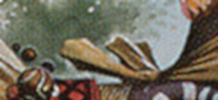
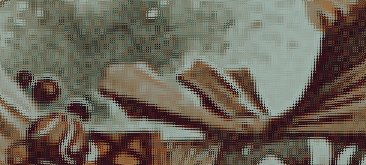
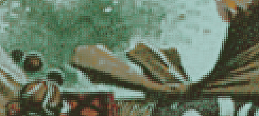
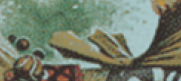

# neural-network-rosette

Try to use a neural network to enlarge a low quality scan 3X times.

## Input

The file use to train the input

3X cubic interpolation (Gimp)

## Output

The file used to train the output

## Neural network output

5'000 random pixels training iterations

50'000 random pixels training iterations

500'000 random pixels training iterations

