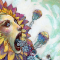
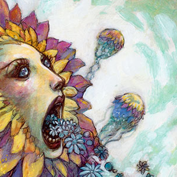
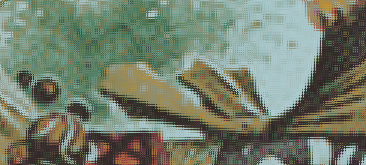
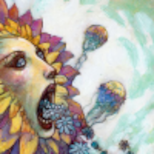

# neural-network-rosette

Try to use a neural network to enlarge a low quality scan 3X times.

## Input

The file use to train the input

## Output

The file used to train the output

## Neural network output

100'000 random pixels training iterations

For comparison, Gimp 3x scale up, lo-halo algorithm

