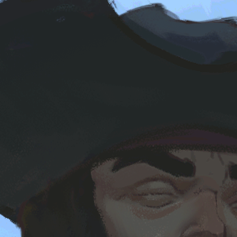
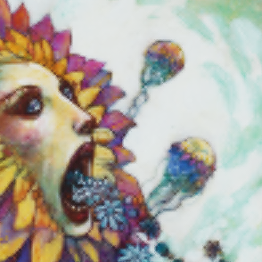
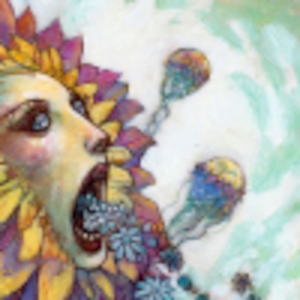

# neural-network-rosette

Try to use a neural network to enlarge a low quality scan 3X times.

My original idea was to "fix" scans of MTG cards that contains the typical moiré pattern typical of offest printing.

The problem was to find good training data (clean image + moiré image) that would align perfectly has training data. So at the end I just did use simple scaled down image and forgot about the moiré.

## Input

The file use to train the input

## Output

The file used to train the output

## Neural network output

100'000 random pixels training iterations

For comparison, Gimp 3x scale up, lo-halo algorithm

