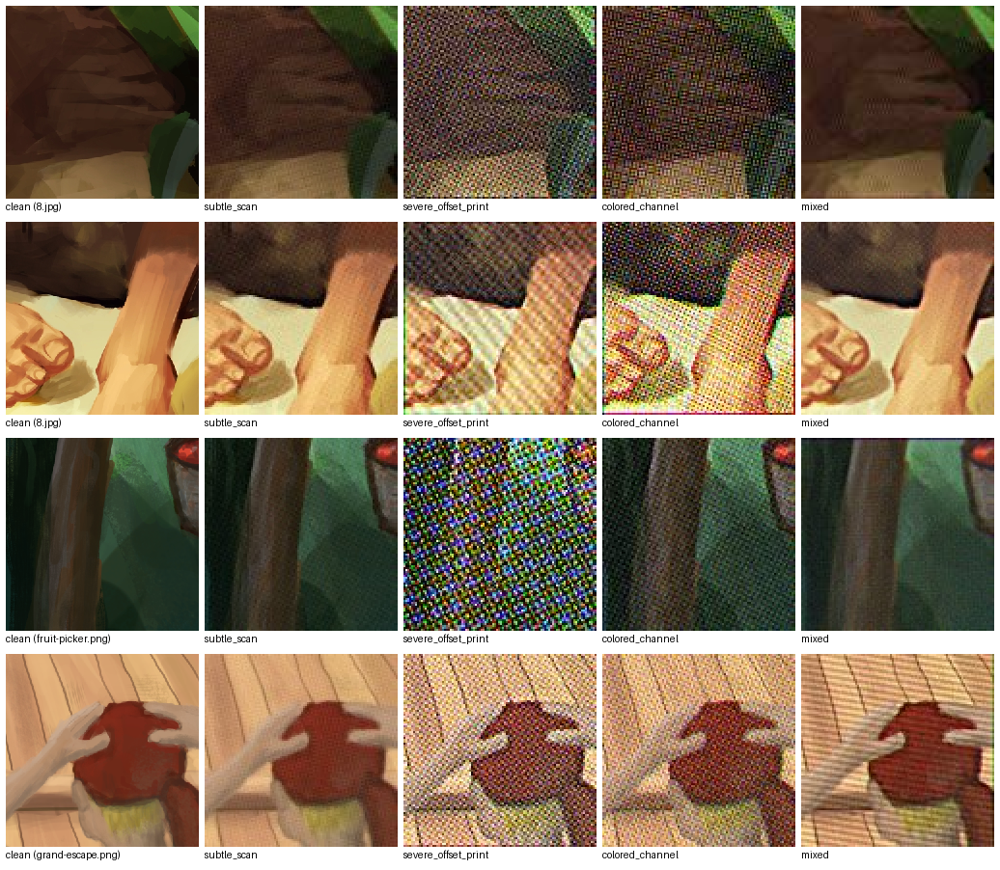
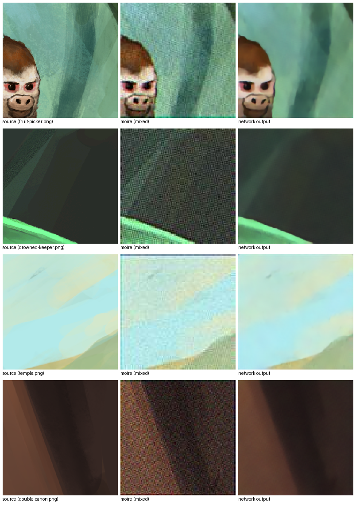
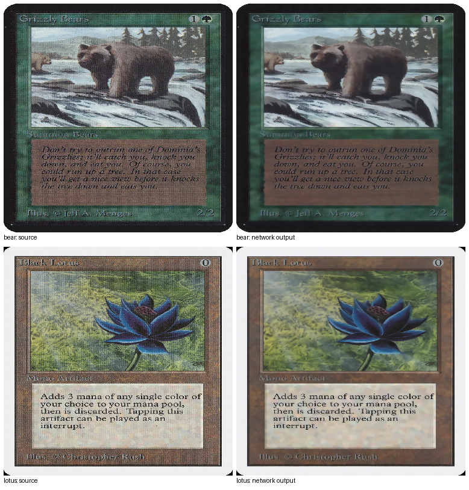

# neural-network-rosette

Try to use a neural network to enlarge a low quality scan 3X times.

My original idea was to "fix" scans of MTG cards that contains the typical moiré pattern typical of offest printing.

The problem was to find good training data (clean image + moiré image) that would align perfectly has training data. The fix: synthesize the moiré instead of scanning for it — degrade clean, high-resolution digital artwork with a simulated offset-print pattern, and train on that paired data.

## How it works

- Clean, high-resolution digital artwork (`sources/`) is used as training targets — no real scans needed.
- Random crops of those images are synthetically degraded (`moire.py`) to simulate offset-print moiré: a per-channel halftone screen at rosette angles, sinusoidal interference banding, channel misregistration, variable effective scan resolution, blur, sharpening halos, sensor noise, and JPEG artifacts.
- Some crops get random text/line overlays (`graphics.py`) before degrading, and `sources/` also includes procedurally generated text/gradient/shape images (`generate_synthetic_sources.py`) — the photographic art sources have essentially no sharp graphic-design content (typography, hard-ruled lines) on their own, so without this the model never learns to reconstruct it.
- A small residual CNN (`model.py`) is trained to predict a correction on top of a bicubic upscale, giving it enough spatial context (a ~47x47 pixel receptive field at the default size, vs. a naive per-pixel approach's 3x3) to actually recognize and remove the pattern instead of guessing per-pixel.
- Quality is tracked with two standard image-comparison scores: **PSNR** (a decibel number for how close two images are pixel-by-pixel — higher means closer, but it doesn't track what actually looks good to a human) and **SSIM** (a 0–1 score approximating structural similarity — edges, contrast, local patterns — a closer match to human judgment, though still imperfect). Besides the whole-image versions, `metrics.py` also tracks an edge-masked variant (computed only on the highest-gradient ~10% of pixels — text strokes, line art, hard boundaries) since whole-image averages are dominated by large flat/textured areas and are known to reward blur over genuine sharpness. `train.py` selects `best.pt` by edge PSNR, not whole-image PSNR.

### Network architecture

`TinySRNet` (`model.py`), at the default `--channels 80 --num-blocks 10` (~1.73M parameters total):

```
            input: 3 x H x W  (low-res, degraded patch)
                          │
        ┌─────────────────┴──────────────────┐
        │                                     │
        ▼                                     ▼
  Conv 3x3, 3→80                    bicubic upscale x3
  + ReLU  ("head")                  (fixed, no learning)
        │                                     │
        ▼                                     │
  80 x H x W  ────────────────┐               │
        │                     │ skip          │
        ▼                     │               │
  ┌───────────────────┐       │               │
  │  ResidualBlock      │      │               │
  │  ────────────────   │      │               │
  │   in ──┬─────────┐  │      │               │
  │        │         │  │      │               │
  │   Conv 3x3 80→80 │  │      │               │
  │   + ReLU         │  │      │               │
  │        │         │  │      │               │
  │   Conv 3x3 80→80 │  │      │               │
  │        │         │  │      │               │
  │        └── + ────┘  │      │               │
  │           out        │      │               │
  └─────────┬─────────────┘      │               │
            │  (x10, stacked)    │               │
            ▼                    │               │
  Conv 3x3, 80→80 ("body_tail")  │               │
            │                    │               │
            + ◄───────────────────┘               │
            │                                     │
            ▼                                     │
  80 x H x W  ("feat")                             │
            │                                     │
            ▼                                     │
  Conv 3x3, 80→720 (=80x3x3)                       │
            │                                     │
            ▼                                     │
  PixelShuffle(3): 720xHxW → 80x3Hx3W              │
            │                                     │
            ▼                                     │
  ReLU, then Conv 3x3, 80→3                        │
            │                                     │
            ▼  3 x 3H x 3W ("correction")          │
            └──────────────┬──────────────────────┘
                            ▼  correction + skip, clamp to [0, 1]
                  output: 3 x 3H x 3W  (upscaled, cleaned)
```

| stage | op | shape in → out | params |
|---|---|---|---|
| head | Conv 3x3 | 3xHxW → 80xHxW | 2,240 |
| 10x residual block | 2x Conv 3x3 (80→80) each | 80xHxW → 80xHxW | 115,360 each, 1,153,600 total |
| body_tail | Conv 3x3 | 80xHxW → 80xHxW | 57,680 |
| upsample conv 1 | Conv 3x3 | 80xHxW → 720xHxW | 519,120 |
| PixelShuffle(3) | rearrange, no learned weights | 720xHxW → 80x3Hx3W | 0 |
| upsample conv 2 | Conv 3x3 | 80x3Hx3W → 3x3Hx3W | 2,163 |
| **total** | | | **≈1,734,800** |

The residual blocks and the bicubic skip connection are the two ideas doing most of the work: the skip means the network only ever has to learn a *correction* on top of a reasonable starting point (never the image from scratch), and each residual block's `out = in + conv(conv(in))` lets gradients flow straight through during training rather than having to pass through 10 stacked layers' full nonlinearity, which is what makes a network this deep practical to train from scratch on a laptop.

## Setup

```
python3 -m venv .venv
.venv/bin/pip install -r requirements.txt
```

## Synthetic moiré presets

`generate_moire.py` samples random crops from `sources/` and runs each through every degradation preset, so the parameters can be inspected before training:

```
.venv/bin/python generate_moire.py --seed 1 --out moire_preview.png
```



## Results

`results.py` runs the trained model on fresh synthetic crops: source / degraded moiré input / network output.

```
.venv/bin/python results.py --checkpoint checkpoints/best.pt --out results.png
```



## Real-world results

The above is all synthetic — the actual test is real photos of physical cards, not synthetically degraded crops. `real_world_results.py` runs inference on a couple of real card photos and panels a 3x Lanczos upscale (the strongest classical resampling filter, per `evaluate.py`) against the network output, side by side at matching resolution:

```
.venv/bin/python infer.py --checkpoint checkpoints/best.pt --input bear.webp --output bear_upscaled.png
.venv/bin/python infer.py --checkpoint checkpoints/best.pt --input lotus.webp --output lotus_upscaled.png
.venv/bin/python real_world_results.py --out real_world_results.png
```



The image above is pasted at full native resolution (lossless), but it's displayed here scaled down to fit the page — **[download the full-resolution PNG](https://raw.githubusercontent.com/batiste/neural-network-rosette/master/real_world_results.png)** (~26MB) to see it at actual pixel size, or open it locally after cloning. Note that Lanczos, having done no denoising, just enlarges the source's existing noise/grain along with it — the network output is visibly cleaner at comparable letterform sharpness, which is really the network's main real contribution here rather than out-sharpening a good classical filter on edges alone.

Illustration detail and body/rules text come out clearly sharper than the source at this scale. The one honest weak point: small embossed title text (light gray on a textured card border) hasn't improved as much as everything else across several rounds of tuning — it's plausibly close to an information floor for what a model this size, trained this way, can confidently reconstruct from the signal actually present in the source photo, rather than something more data or training would keep fixing.

## Training and inference

```
.venv/bin/python train.py --epochs 30 --checkpoint-dir checkpoints    # train (auto-uses MPS on Apple Silicon)
.venv/bin/python infer.py --checkpoint checkpoints/best.pt --input some_image.png --output upscaled.png
```

`train.py` holds out `--val-count` images in `sources/` for validation (stratified between photographic and synthetic sources, see `dataset.split_sources`), logs PSNR/SSIM and edge PSNR/SSIM per epoch, and writes a preview panel (input/bicubic/prediction/target) every `--preview-every` epochs plus `latest.pt`/`best.pt` checkpoints under `--checkpoint-dir`. `checkpoints/best.pt` is committed to the repo (~20MB) so `infer.py`/`results.py` work out of the box without retraining; everything else under `checkpoints/` (per-epoch previews, optimizer state, training history) is gitignored.

`sources/` holds the clean training images: photographic/painterly artwork plus the procedurally generated text/gradient/line/shape images from `generate_synthetic_sources.py` (regenerate anytime with a different `--seed`; nothing there is hand-crafted, so it isn't committed either). The small `.jpg` files are tracked in git; the larger `.png` ones are gitignored (`*.png`) since they're multi-megabyte originals — keep your own copies there locally, `train.py` just needs at least a handful of images in that directory.

Run any script with `--help` for the full set of options.
